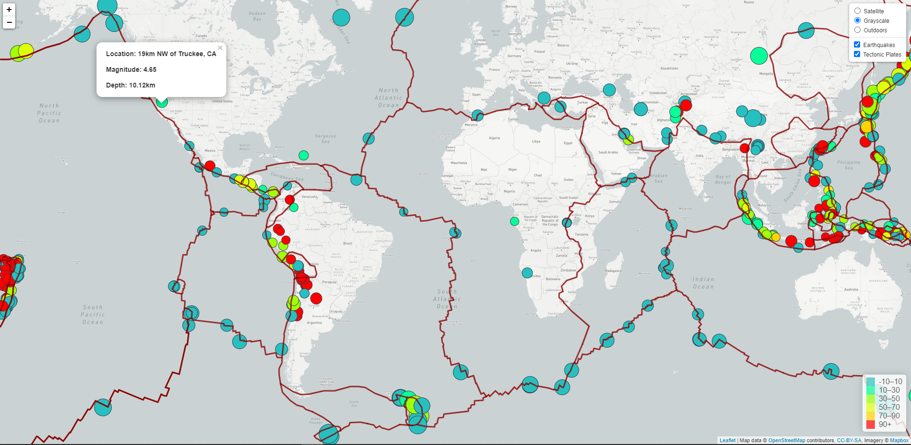

# Visualizing Data with Leaflet

In this project, I used the United States Geological Survey (USGS) past 30 days M4.5+ earthquakes dataset.  I used [the URL](https://earthquake.usgs.gov/earthquakes/feed/v1.0/summary/4.5_week.geojson) to pull the data for this visualization. I created a map using Leaflet that plots all of the earthquakes from this data set based on their longitude and latitude.

2. * The data markers reflect the magnitude of the earthquake by their size and depth of the earth quake by color. Earthquakes with higher magnitudes should appear larger and earthquakes with greater depth should appear darker in color.
   * The popups provide additional information (the magnitude, the location and depth) about the earthquake when a marker is clicked.
   * The legend shows the depth and their corresponding color.
2.   A second data set on the map illustrates the relationship between tectonic plates and seismic activity. Data on tectonic plates can be found at <https://github.com/fraxen/tectonicplates>.

- - -

© 2021 Trilogy Education Services, LLC, a 2U, Inc. brand. Confidential and Proprietary. All Rights Reserved.
